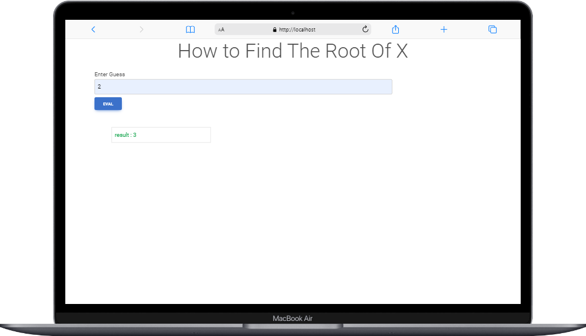

<h1 align="center">Root of X</h1>

 The Most Wonderful Root of x function.

	 

<h2> how to use this repo </h2>
  

- You should have Web Server such as Xammp or MAMMP
- add the repo to `Webserver/htdocs`
- and start use this repo 
- there's verison for this repo would be produce **@team.pandaShell** 

